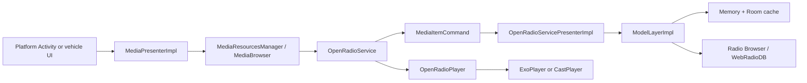

# OpenRadio Project Overview

OpenRadio is a Kotlin Android internet-radio client targeting phones and tablets, Android Auto, Android TV, and native Android Automotive OS. It consumes station directories from [Radio Browser](https://www.radio-browser.info/) and [WebRadioDB](https://jcorporation.github.io/webradiodb/), then exposes browsing and playback through an Android Media3 `MediaLibraryService`.

The platform modules are mostly UI shells over shared networking, persistence, media-session, and playback code.

## Module structure

```text
common
  └── common-ui
       ├── app          phone/tablet and Android Auto
       ├── tv           Android TV
       └── automotive   Android Automotive OS
```

All five modules are declared in `settings.gradle`.

| Module | Responsibility |
| --- | --- |
| `common/` | Domain models, provider APIs, parsing, caching, persistence, playback, Media3 service, Cast, equalizer, location, timers, and broadcast receivers |
| `common-ui/` | Shared presenter, RecyclerView adapter base, dialogs, cloud backup, logging, and service-command glue |
| `app/` | Phone/tablet UI and Android Auto metadata |
| `tv/` | D-pad-oriented Android TV UI and voice search |
| `automotive/` | Native automotive packaging and settings; the vehicle system renders the media-browser UI |

All application modules use the same `applicationId`, `com.yuriy.openradio`. They are alternate APKs rather than independently installable companion applications.

## Core architecture

The central component is `common/src/main/java/com/yuriy/openradio/shared/service/OpenRadioService.kt`, a Media3 `MediaLibraryService`. It owns:

- The `MediaLibrarySession`
- The browsable station hierarchy
- Station selection and playback
- Search and playback resumption
- Favorite commands
- Network-state handling
- Bluetooth reconnect and “becoming noisy” behavior
- Sleep-timer completion
- Custom commands from the application UIs

The service advertises both `android.media.browse.MediaBrowserService` and `androidx.media3.session.MediaLibraryService`. This lets the same content tree serve the phone UI, Android Auto, Automotive OS, and other MediaBrowser clients.

### Runtime flow



A typical browse request follows this path:

1. `MediaPresenterImpl` creates a `MediaResourcesManager`.
2. `MediaResourcesManager` builds a Media3 `MediaBrowser` connected to `OpenRadioService`.
3. The UI requests children under a media ID such as root, countries, favorites, popular stations, or search.
4. `OpenRadioService` selects the corresponding `MediaItemCommand`.
5. The command calls `OpenRadioServicePresenterImpl`, which delegates to the provider and model layers.
6. Provider data is downloaded, cached, parsed into `RadioStation` values, and converted to Media3 `MediaItem`s.
7. `BrowseTree` retains the child items and their station mapping in memory.
8. Selecting a playable item causes the service to prepare and play it through `OpenRadioPlayer`.

`MediaResourcesManager.kt` is the client-side Media3 wrapper. It connects to the service with a `SessionToken`, requests library roots and children, listens for player state and metadata, and sends custom session commands.

## Browsable content model

`MediaId.kt` defines identifiers for:

- Root
- Categories and child categories
- Countries and country stations
- Favorites
- Local or user-defined stations
- Featured stations
- Popular and new stations
- Search results
- Automotive-specific browse nodes

Content generation uses a command pattern. Separate `MediaItemCommand` implementations produce major nodes such as `MediaItemFavoritesList`, `MediaItemCountriesList`, `MediaItemCountryStations`, `MediaItemSearchFromApp`, and `MediaItemBrowseCar`.

`BrowseTree.kt` is an in-memory cache mapping parent IDs to child `MediaItem` lists, corresponding `RadioStation` sets, and individual item lookups. Nodes are invalidated when favorites, sorting, source selection, or local stations change.

## Station providers and parsing

`SourcesLayer` selects the active provider.

### Radio Browser

`UrlLayerRadioBrowserImpl.kt` builds Radio Browser API requests for:

- Tags and categories
- Stations by tag or country
- Most-clicked stations
- Recently changed stations
- Search
- Station submission
- Country lists

It performs DNS discovery for available Radio Browser servers, caches discovered hosts, chooses one, and retains fallback mirrors. `ParserLayerRadioBrowserImpl` parses JSON results into `RadioStation` objects. Pagination uses a shared page size of 250.

### WebRadioDB

`UrlLayerWebRadioImpl.kt` uses static JSON datasets hosted through GitHub Pages:

```text
https://jcorporation.github.io/webradiodb/db/index/webradios.min.json
https://jcorporation.github.io/webradiodb/db/index/countries.min.json
```

Unlike Radio Browser, it downloads a whole dataset and applies category, country, or search filtering while parsing it.

### Stream and playlist handling

The project embeds William Seemann's JavaPlaylistParser with support for:

- M3U
- M3U8
- PLS
- ASX
- XSPF

This resolves station URLs that point to playlists rather than directly to audio streams.

## Playback

`OpenRadioPlayer.kt` wraps:

- Media3 `ExoPlayer` for device playback
- Media3 `CastPlayer` for Google Cast

The ExoPlayer path supports HLS and DASH alongside ordinary internet-radio streams. Buffer sizes are configurable through preferences; `MainAppCommon` validates them at startup and restores Media3 defaults when their ordering is invalid.

Other playback facilities include:

- ICY stream metadata
- Persisting and restoring the last station
- Mobile-network playback restrictions
- Bluetooth auto-resume
- Pause on audio-output disconnection
- Master-volume control
- Sleep timer
- Android hardware equalizer support

`EqualizerLayerImpl` binds Android's `audiofx.Equalizer` to the ExoPlayer audio session and persists band state through `EqualizerStorage`.

## Persistence and caching

The project deliberately uses several storage mechanisms for different data.

### SharedPreferences

Most settings and small domain collections use SharedPreferences through `AbstractStorage`:

- Favorites
- User-added or local stations
- Last played station
- Location and country choice
- Network preferences
- Sleep-timer state
- Equalizer state
- Buffering and general application settings

Stations are serialized to JSON and stored under station IDs.

### Room

Room databases have two bounded uses:

- Station artwork in `ImagesDatabase`
- Persistent API responses in `PersistentApiDb`

API responses have an in-memory first-level cache and a Room-backed second-level cache with a 24-hour expiry. Artwork is exposed through the custom `ImagesProvider` content provider.

### Firebase

Firebase provides:

- Crashlytics
- Analytics
- Authentication
- Firestore

`CloudStoreManager` signs users in and uploads or downloads serialized favorites and local stations. Firestore also supplies the featured-stations feed.

## Dependency wiring

There is no dependency-injection framework. `DependencyRegistryCommon`, `DependencyRegistryCommonUi`, and platform registries manually construct singleton objects and inject them through `configureWith()` interfaces.

At startup, `DependencyRegistryCommon.init()` creates the main object graph:

- Provider URL and parser layers
- Downloader
- In-memory and Room API caches
- Model layer
- Station storages
- Image persistence
- Equalizer
- Cast integration
- Network monitor
- Sleep timer
- Radio-station manager
- Service presenter

It also detects whether the process is running on TV or in a car and whether Google Play Services are available.

## Platform variants

### Phone and tablet: `app/`

The entry points are `MainApp.kt` and `MainActivity.kt`. `MainActivity` is a single-instance `AppCompatActivity` using a drawer/navigation layout. It provides:

- Station and category browsing
- Search
- Equalizer
- Add, edit, and remove operations for local stations
- General, network, and stream-buffer settings
- Sleep timer
- Cloud storage and account operations
- Cast support
- About information

Its list adapter supports swipe-to-reveal station actions. The manifest also advertises Android Auto compatibility. Android Auto connects directly to the shared `OpenRadioService`; it does not use a separate projected-car Activity.

### Android TV: `tv/`

The entry points are `MainAppTv.kt`, `TvMainActivity.kt`, and `TvSearchActivity.kt`. The TV APK requires Leanback support, does not require a touchscreen, and uses focus and D-pad-oriented layouts. It supplies:

- A TV-specific media adapter
- Search, equalizer, settings, and add-station actions
- Voice search through `SearchSupportFragment`
- `RECORD_AUDIO` permission for voice input

The activity exits when the TV APK is launched on a non-TV device.

### Android Automotive: `automotive/`

The entry points are `MainAppAutomotive.kt` and `AutomotiveSettingsActivity.kt`. This module requires `android.hardware.type.automotive` and re-declares the shared media service for Automotive OS.

It has no conventional station-browsing Activity. The vehicle host renders the MediaLibrary tree supplied by `OpenRadioService`. The only Activity is exposed through `APPLICATION_PREFERENCES` and manages settings such as:

- Provider selection
- Last-station restoration
- Country
- Cache clearing
- Master volume
- Stream buffering
- Cloud backup and account state
- Log collection

## Android components and permissions

The shared manifest registers:

- `OpenRadioService`
- `LocationService`
- `ImagesProvider`
- AndroidX `FileProvider`
- Cast options metadata

Permissions cover internet and network state, wake lock, coarse location, foreground media playback, Bluetooth state and connection, external image access, and TV microphone access. Location is used to choose a likely local country. Offline country-boundary data is shipped in `common/src/main/assets/boundaries.ser`.

The shared application manifest enables cleartext traffic and exports `ImagesProvider`; these are notable deployment and security settings.

## Build and release

| Component | Version |
| --- | ---: |
| Gradle wrapper | 8.0 |
| Android Gradle Plugin | 8.1.2 |
| Kotlin | 1.9.10 |
| JVM target | Java 8 |
| Compile and target SDK | 34 |
| Mobile minimum SDK | 17 |
| TV minimum SDK | 21 |
| Automotive minimum SDK | 28 |
| Media3 | 1.2.0 |
| Room | 2.6.0 |
| OkHttp | 3.12.13 |

OkHttp and the Firebase BOM are pinned to versions compatible with API 17.

The configured release version is `14.1.1`; `version.properties` contains version code `674`. `sign.gradle` reads a gitignored `sign.properties`, signs builds with that keystore, and increments the version code after `signReleaseBundle` completes.

Historical APKs are retained under `app/store/`. No continuous-integration workflow is present under `.github`; release signing and version advancement are developer-run Gradle tasks.

## Tests and project state

The repository contains:

- Two JVM unit-test files under `common/src/test`
- Nine Android instrumentation-test files under `app/src/androidTest`
- The stream-detection fixture `undetected_streams.txt`

Coverage includes playlist detection, station serialization, media-ID helpers, storage, equalizer serialization, network utilities, and the image provider. There are no TV- or Automotive-specific tests.

The project is licensed under Apache 2.0. `NOTICE` attributes the embedded playlist parser, country-boundary data, and Android Open Source Project material. The visible build and version files date from 2023, so the dependency choices reflect the Android and API compatibility constraints of that period.
